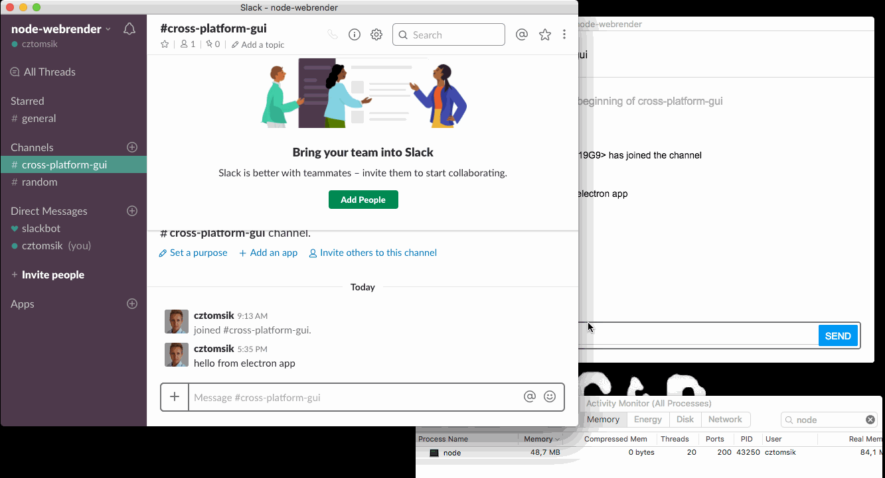
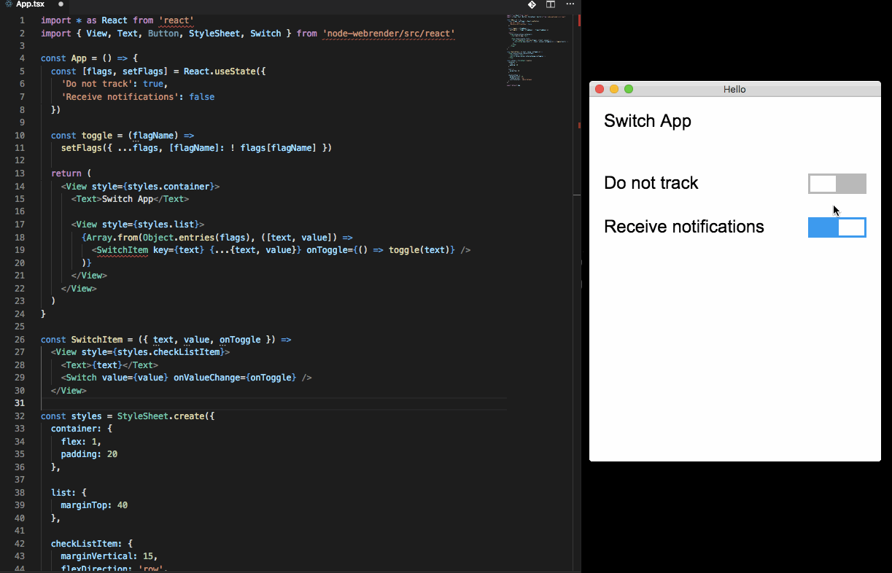

# node-webrender
[webrender](https://github.com/servo/webrender) bindings for node.js & react

## Samples
Easiest way to start is to just clone of these apps:
- https://github.com/cztomsik/brew-cleaner
- https://github.com/cztomsik/slack-app

## Requirements
- node.js 10.14.1
- [rustc 1.31.1 & cargo 1.31.0](https://rustup.rs/)
- (debian/ubuntu) `sudo apt install g++ cmake pkg-config python libfreetype6 libfreetype6-dev expat libexpat-dev`
- (osx) should work without any deps (but if you need something it should be just one `brew install` away)

## Getting started
```
npm i node-webrender
```

Low-level api is very simple and follows `serde-json` format for particular `*DisplayItem`s from `webrender::api`. There is no object model, just buckets, representing particular display items, excluding their layout info. Updates are done with `updateBucket(bucket, payload)`. To render, you need to pass buckets along with layout infos. This is mostly because of speed - you can read more on the bottom.

There is also experimental **react binding** which is much more suited for any real UI development. Vue bindings will be added as soon as Vue3 will get published.

```
const { Window } = require('node-webrender')
const RED = [1, 0, 0, 1]

// create window and bucket with red rectangle
const w = new Window()
const b = w.createBucket({ Rectangle: { color: RED } })

w.render({
  bucket_ids: [b],
  layouts: [[0, 0, 100, 100]]
})
```

## React bindings
You will need typescript if you want to play with this.

```
mkdir hello-app
cd hello-app
npm init -y
npm i node-webrender react@next react-reconciler@next yoga-layout
npm i ts-node typescript --save-dev 
```

Then you can create `main.tsx` with:

```
import * as React from 'react'
import { Window } from 'node-webrender'
import { render, View, Text } from 'node-webrender/src/react'

const App = () =>
  <View>
    <Text>Hello</Text>
  </View>

render(<App />, new Window("Hello"))
```

and it should show some text if you run it with `npx ts-node -I '//' -O '{"jsx": "react", "target": "es2017"}' -T main.tsx`. Note that es2017 is really important here - otherwise no text will be shown. All of this is a bit hairy for now.

## Running examples
```bash
git clone https://github.com/cztomsik/node-webrender
cd node-webrender
npm install
npx ts-node -T example/<file>
```

## Things to note
- this is very early preview and things will change
- negative dimensions will block forever (WR will not generate a frame)
- fontSize can now be only one of [10, 12, 14, 16, 20, 24, 34, 40, 48]
- mem usage of production release, including node is ~20M + additional libs you use (but you have to build it yourself with `npx neon build --release` inside your `node_modules/node-webrender` directory because it takes forever)
- `examples/react-calculator.tsx` can then run with ~30M if TS is precompiled first (`npx tsc react-calculator.tsx --jsx react -t es2017 -m commonjs && node react-calculator.js`)
- release build is ~10MB on disk
- for `react-devtools` you need to add `react-devtools-core` and `ws` to your project
- there is a bug in typescript so you may need to wrap styles in StyleSheet.create()

## Out of scope
- **cascading** stylesheets
- accessibility
- RTL and vertical languages
- inline layout for components
- word-break, white-space (pre, pre-line, pre-wrap, nowrap)

## TODO
- [x] call rust, show window, init webrender
- [x] clear screen, show rect
- [x] load font
- [x] react example
- [x] yoga
- [x] text, word-wrap, linebreak, spaces, nbsp
- [x] click
- [x] scrolling
- [x] input
- [x] window resize
- [ ] more example apps
- [ ] docs
- [ ] hover
- [ ] more fonts
- [ ] send binary buffers (flatbuffer/bincode/?)

## Contributing
Issues and ideas are very welcome but please don't submit any code, it's still changing a lot.

## How does it work (internally)
You don't need to read this actually, it's mostly for me, to keep a big picture and decisions what has been made.

### Overview
  - webrender is about drawing as many rects and glyphs as possible (in parallel) using GPU
  - conceptually, every frame has to be drawn from scratch (in correct order), yet it's faster than usual approach
  - drawing UI on GPU is very different from classic approach, we implement few shader programs and then we "just" fill big buffers of floats
  - but everything has to be prepared and well-thought in advance (it's really hard work, not to mention there are bugs in GPU drivers, multiplied by platforms and versions you support, etc.)
  - webrender does this for us and provides an api

### webrender api
  - webrender retains some info about the scene so it can do scrolling/zooming and hitbox testing for us (without rebuilding the scene), so it is not entirely stateless but I wouldn't call it retained-mode either (we don't directly manage any instances of anything)
  - api is useful for font-loading, text measurements, font glyph resolving but also for sending **transactions**
  - nothing is rendered unless transaction is sent (and async **processed**, which is when we swap buffers, etc.)
  - even scrolling/zooming has to be sent in trasaction
  - transaction can also "set" **display list** which is how scene will get rebuilt and re-rendered eventually
  - display list is a binary blob of display items and to make one, it's easiest to use a **builder** (provided by webrender) which has methods like push_rect() and similar
  - **all of this is done in rust**, to avoid crossing boundaries (communication with JS should be kept at minimum)

### drawing from JS
  - one obvious way would be to send JSON (or something) to native, parse it and build the display list on every UI change
    - this is simple and it would actually work but it's also very wasteful because everything has to be visited, generated, serialized, sent and parsed over and over again
  - another approach could be to implement some kind of DOM api which could be then used from JS
    - which sounds good at first but native is really a whole different world and just getting it right is a lot of work, not to mention there's always some overhead so it's impossible to tell if this would be any faster
  - in this light, IPC is not that bad if we can improve it
    - for example, we could have a (window-local) vector of all display items in their creation order
    - any UI change would send JSON (or something) to replace display item in-place (so it's like a bucket)
    - to generate a display list we just need indices of those items
    - this could/should be fast because everything is in the same area of memory so it should go through CPU caches
    - we can also separate the layout (position and dimensions) which will further reduce the need for updates
 
BTW: I've made a [search engine for javascript libraries](http://searchlibs.com) if you're ever in a need for some other libs.
