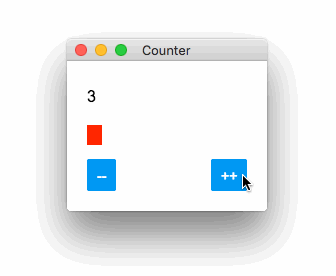

# stain
Rapid GUI development using familiar technologies (javascript, flexbox, css)

---

<div style="display: flex; align-items: center">
<div style="max-height: 400px; overflow-y: scroll">

```javascript
const App = () => {
  const [count, setCount] = useState(0)
  const dec = () => setCount(count - 1)
  const inc = () => setCount(count + 1)

  return (
    <View style={styles.counter}>
      <Text>{count}</Text>

      <View style={[styles.bar, { width: count * 5 }]} />

      <View style={styles.buttons}>
        <Button title="--" onPress={dec} />
        <Button title="++" onPress={inc} />
      </View>
    </View>
  )
}

const styles = StyleSheet.create({
  counter: {
    flex: 1,
    padding: 20,
    justifyContent: 'space-between'
  },

  bar: {
    backgroundColor: '#ff0000',
    height: 20
  },

  buttons: {
    flexDirection: 'row',
    justifyContent: 'space-between'
  }
})
```

</div>

</div>
<br>

## Status
Please note that we are still finishing major rewrite which started almost 3 months ago (yeah, I know but it was really needed) so the docs are off (a lot). That said, we've also gained some other cool features along the way (text-align, images, shadow). As with other hobby projects, there are no ETAs, but it's very close now. Follow me on my [twitter](https://twitter.com/cztomsik) to get notified :-)

## Why it's interesting
- quick to setup, apart from rust & few libs, it should be just one `npm install` away
- can be combined with most of the libraries you already know (react, mobx, lodash, ...)
- works with existing tooling (debug in vscode, profile in chrome devtools, react-devtools, ...)
- hot-reload works even without webpack (and it's faster)
- bundle can be made using already established and mature tools (ncc + electron-builder)
- low memory footprint (when compared to electron)
- the language & platform you already know (when compared to flutter)

---

## Documentation
Please refer to respective sub-page on the
[project website](http://tomsik.cz/stain)

## License
This project is [MIT licensed](./LICENSE). By contributing to this project, you also agree that your contributions will be licensed under the MIT license.
