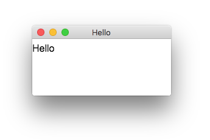
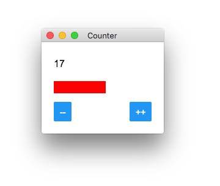
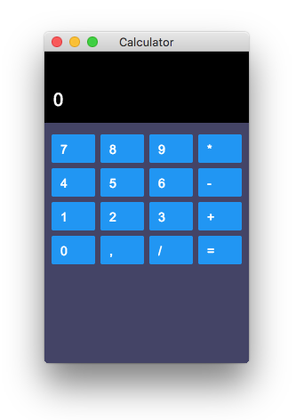

# Examples


## Running examples
```bash
git clone https://github.com/cztomsik/graffiti
cd graffiti
npm install
npm run example
```

This should open example browser where you can select each example & run it using a button at the top. Alternatively, you can run examples with `npm run example <name>`.

## [react-hello.tsx](https://github.com/cztomsik/node-webrender/tree/master/examples/react-hello.tsx)


## [react-count.tsx](https://github.com/cztomsik/node-webrender/tree/master/examples/react-count.tsx)


## [react-calc.tsx](https://github.com/cztomsik/node-webrender/tree/master/examples/react-calc.tsx)



---

## Other examples

## [slack-app](https://github.com/cztomsik/slack-app)

