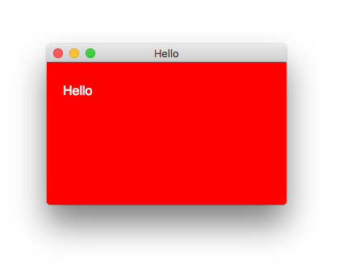
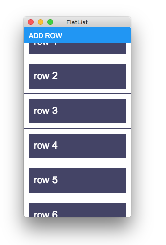
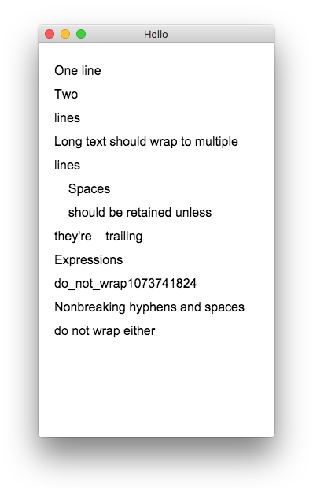

# Examples


## Running examples
```bash
git clone https://github.com/cztomsik/node-webrender
cd node-webrender
npm install
npx ts-node -T example/<file>
```

## [hello.ts](https://github.com/cztomsik/node-webrender/tree/master/example/hello.ts)


## [react-hello.tsx](https://github.com/cztomsik/node-webrender/tree/master/example/react-hello.tsx)


## [react-counter.tsx](https://github.com/cztomsik/node-webrender/tree/master/example/react-counter.tsx)


## [react-calculator.tsx](https://github.com/cztomsik/node-webrender/tree/master/example/react-calculator.tsx)


## [react-flatlist.tsx](https://github.com/cztomsik/node-webrender/tree/master/example/react-flatlist.tsx)


## [react-wordwrap.tsx](https://github.com/cztomsik/node-webrender/tree/master/example/react-wordwrap.tsx)



---

## Other examples

## [slack-app](https://github.com/cztomsik/slack-app)

