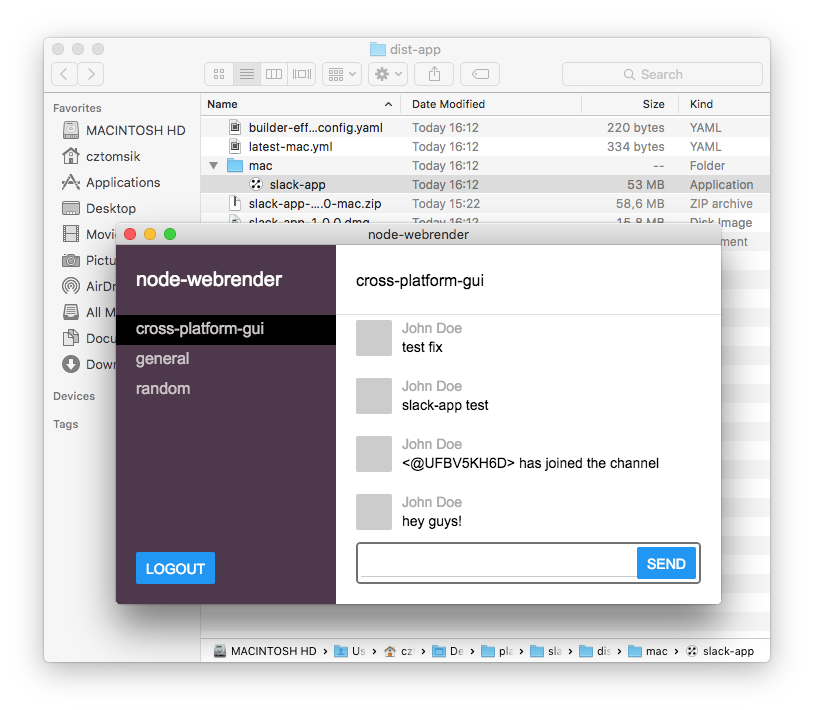

# Packaging

**This is very outdated & likely not true anymore but it's still possible to build a package using electron-builder, it's just that the information here might not be exact/complete**

## Build optimized version native module (optional)
Compiling rust takes forever so by default we build in dev mode. There's not a huge difference in performance
but it's way smaller so it's something you probably want to do before shipping your app. All what you need to do
is to go to `node_modules/node-webrender` directory and run `../.bin/neon build --release`. It will take 5-10 minutes.

## Bundle your app (optional)
Another good idea is to bundle your application into one big file, preferably with `NODE_ENV=production` environment
variable set. Use whatever you prefer (and know) or you can try [ncc](https://github.com/zeit/ncc).

```bash
# generate a bundle to dist/*
ncc build -e yoga-layout src/main.tsx

# and this is how you run it then
node dist/index.js
```

## Make a package
The easiest way is to use electron-builder with some custom configuration. So first you
`npm install -g electron-builder` and then you need to do some changes to your `package.json`:

- first, make sure your `main` points to bundle location (`dist/index.js` if you've used ncc above)
- add `build` entry with options like below
- optionally add other custom [build options](https://www.electron.build/configuration/configuration)
- run `electron-builder`. pass custom [cli options](https://www.electron.build/cli) if needed
- app package should be now in newly created `dist-app` folder

```json
  "main": "path/to/bundle",

  "build": {
    "protonNodeVersion": "current",
    "npmRebuild": false,
    "directories": {
      "output": "dist-app"
    },
    "files": [
      "dist",
      "!dist/native/target",
      "!node_modules",
      "node_modules/yoga-layout"
    ]
  }
```


